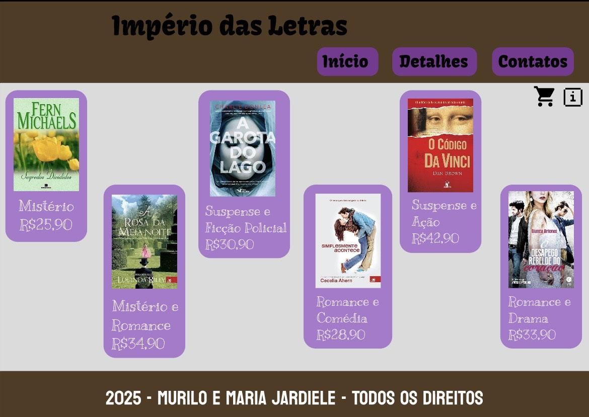
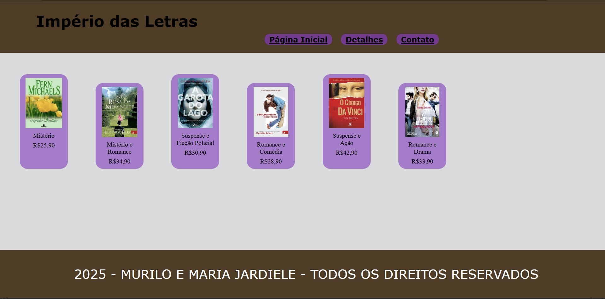
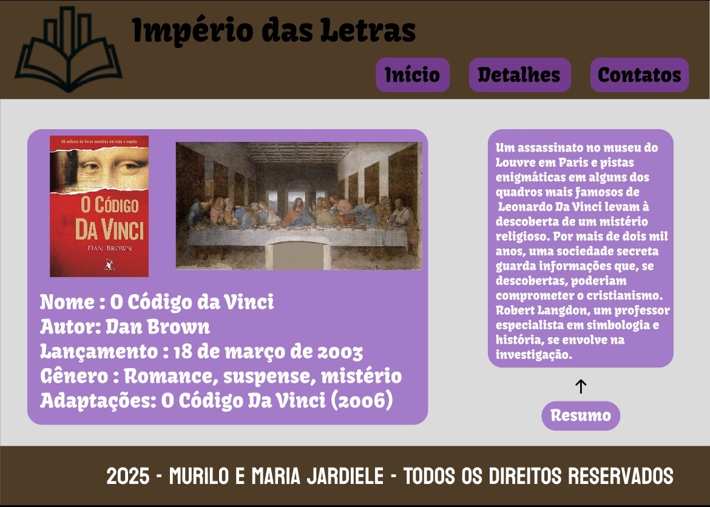
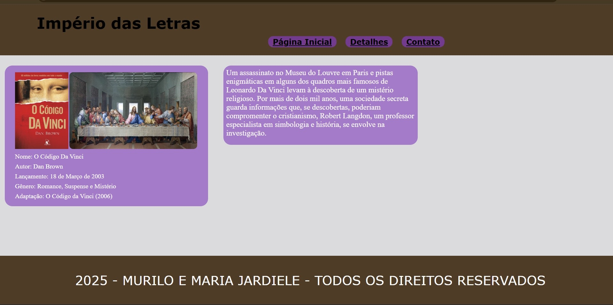
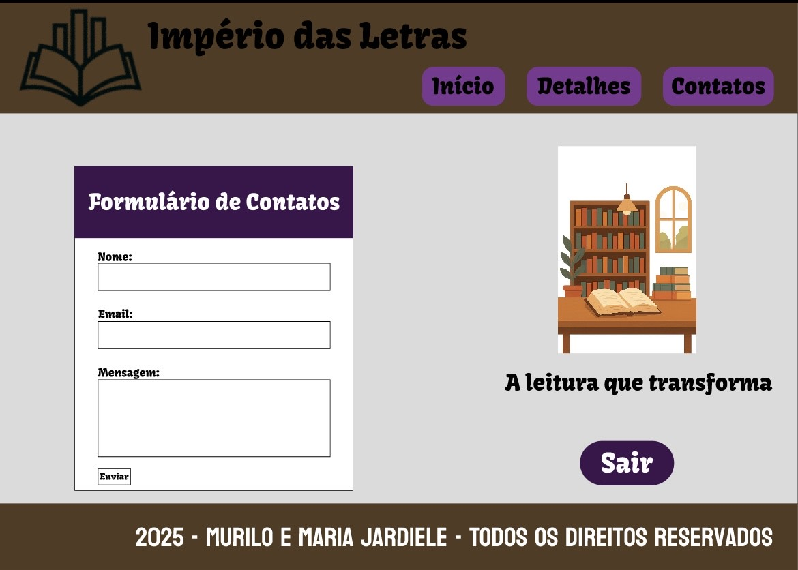
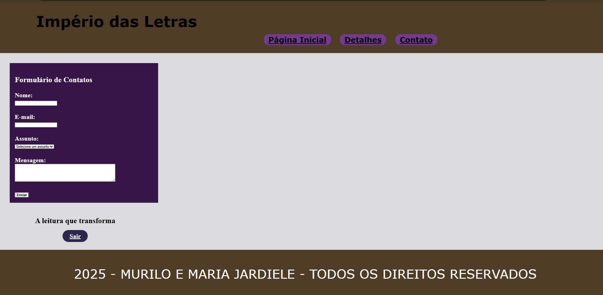

# Protótipo Implementado: Desenvolvimento Web I
### Este trabalho faz parte da disciplina de Desenvolvimento Web I, ministrada pelo professor Thomaz Maia.
### O projeto consistiu na implementação de um protótipo Figma utilizando HTML e CSS, finalizado em 28 de agosto de 2025.

# 👥 Equipe
## O trabalho foi desenvolvido por:
- [Murilo Silva](https://github.com/murilo-neto26)
- [Maria Jardiele Silva](https://github.com/jardiele22)

# 🎨 Design vs. Implementação
### Abaixo estão as capturas de tela do design original (Figma) e da implementação final (HTML/CSS):

Página Inicial - Figma

Página Inicial - HTML/CSS

Detalhes - Figma

Detalhes - HTML/CSS

Contato - Figma

Contato - HTML/CSS

## A seguir as principais semelhanças e diferenças observadas entre o design proposto e a implementação realizada:

O layout e o fluxo de informações foram mantidos.
Tipografia: Ajustes finos no tamanho ou peso da fonte para melhor leitura e visualização.
Paleta de Cores: As cores primárias e secundárias do design foram replicadas.
Espaçamento (Margin/Padding): Pequenas variações no espaçamento para adequação ao comportamento cross-browser.
Elementos Principais: Componentes como header e footer seguiram o padrão do Figma.
Alguns detalhes como os símbolos de carrinho de compras e informações não conseguimos colocar no projeto, assim como a imagem o bloco de resumo e a última imagem da página contato.
